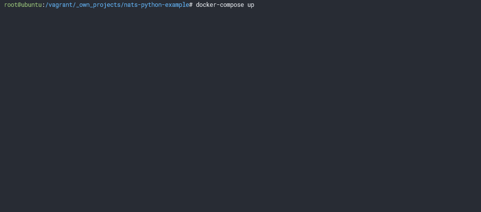
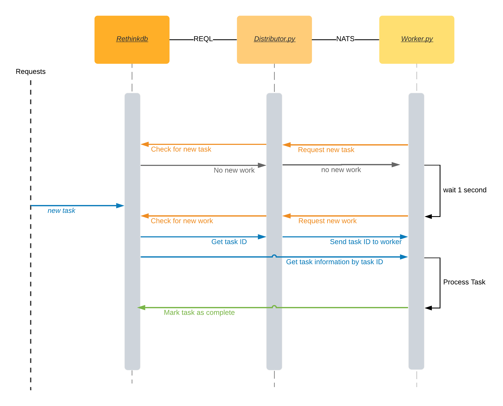

# nats-python-example

Working out the best way to do request/reply for distributing tasks

>So this turned out to be more than just nats and python by introducing Rethinkdb.



## Overview

1. Requests for new workloads go into the database
2. A worker continuously polls the distributor for new tasks
3. For every poll the distributor takes a new task in the `ready` state
4. The distributor marks the task as `active` and forwards it to the worker
5. The worker processes the task
6. if the task fails it gets marked as `ready` and attempts increases by 1 and the worker request a new job
7. if the task succeeds it gets marked as `completed` and the worker requests a new job
8. When a task has been attempted X amount of times it gets marked as `failed`



### A few tidbits

This setup works as microservice setup where every component can be scaled horizontally, meaning
_Rethinkdb_, _NATS_, the _Distributor_ and the _Worker_ can all have multiple instances running simultaneously.

The _Distributor_ listens for polls on a loadbalanced queue, a feature of _NATS_ that works without configuration.

## Dependencies

- python 3.8+
- docker-compose

## Install requirements

```bash
pip install pipenv
pipenv sync --dev
```

## Run the backend

This starts NATS and Rethinkdb 2.4.1

```bash
docker-compose up -d rethinkdb nats
```

## Run the code

Put some fake tasks in the database

```bash
pipenv run generate
```

Run the worker and distributor

```bash
pipenv run distributor
pipenv run worker
```

## Rethinkdb

You can open the rethinkdb webinterface with `http://localhost:8080`

In the data explorer try the query

```javascript
r.db("work").table("tasks").changes()
```

and press the `run` button to watch work happening in realtime


